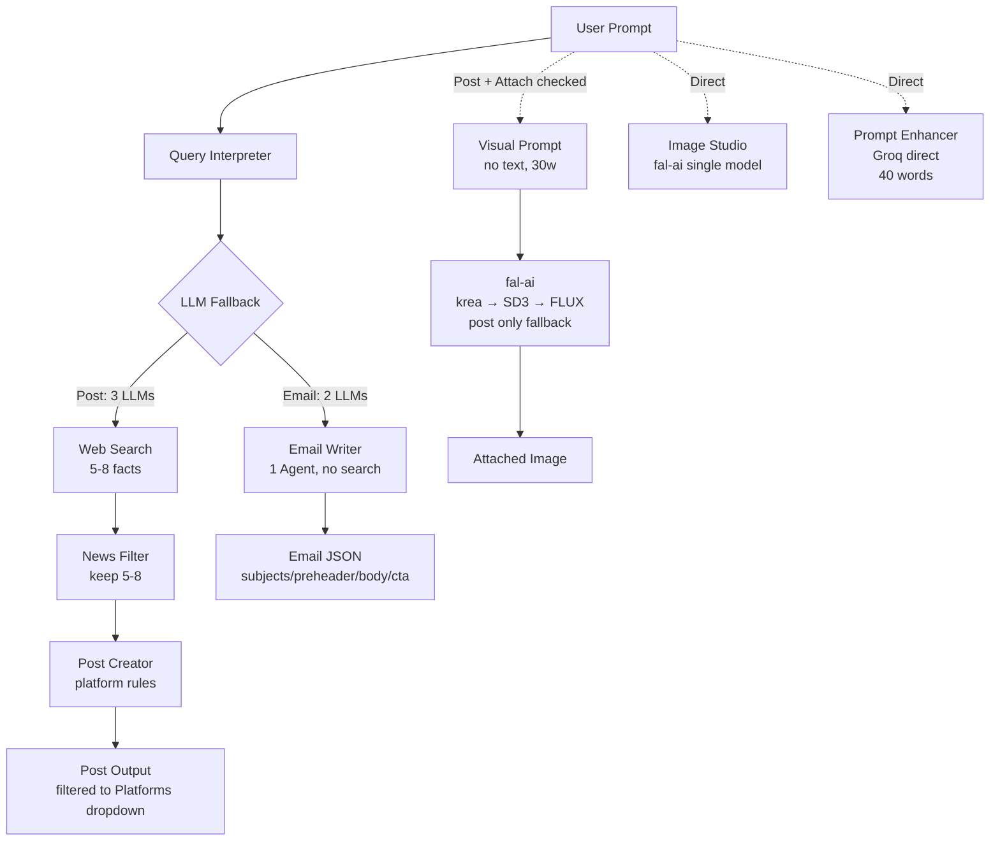

# PostCraft

> No matter what you want — we craft it.

AI-powered content studio to create **social media posts**, **images**, and **emails** in one click.


---

## About

PostCraft is a unified AI workspace for creators, marketers, and job seekers. Generate platform-ready posts, studio-quality images, and high-converting emails from a single prompt — with research, filtering, and brand consistency built in.

Live: `http://127.0.0.1:5000`

---

## Features

**📝 Post Studio**
- Generate for LinkedIn, Instagram, Twitter/X, WhatsApp, Facebook, Telegram, YouTube
- Tone control (Professional, Viral, Casual, Informative)
- Optional image attach

**🎨 Image Studio**
- Text-to-image via HuggingFace `fal-ai` (Krea, SD3, FLUX)
- Style presets and model picker

**✉️ Email Studio**
- 11 types including **Job Application** with ATS-friendly subjects
- Maps resume highlights to job description
- Strict JSON output (subjects, preheader, body)

**✨ Prompt Enhancer**
- One-click prompt improvement for posts and images

---

## Tech Stack

- **Backend:** Flask, CrewAI, LiteLLM
- **LLMs:** Gemini 3.6 Flash, Groq (gpt-oss-120b), HuggingFace (LLaMA 3.1)
- **Search & Image:** Serper.dev, Fal-AI
- **Frontend:** HTML, CSS, JavaScript

---

## Architecture & How Agents Work

PostCraft uses **CrewAI** for Post & Email. Image & Enhancer are direct LLM calls (no Crew).

### Overview — How Many Agents?

- **Post Studio:** **4 Agents, 4 Tasks** — full research pipeline (lightweight 2-agent fallback for Groq)
- **Email Studio:** **1 Agent, 1 Task** — single Email Writer, no web search
- **Image Studio:** **0 Agents** — direct diffusion
- **Prompt Enhancer:** **0 Agents** — direct LLM call

### Flow (Mermaid)



**Post Studio (4 agents, ~30-45s):**
```
User: "create LinkedIn post about AI news" + Platforms=LinkedIn + Tone=Professional
  ↓ [1] Query Interpreter → {platform:LinkedIn, topic:AI, clean_query:"AI news"}
  ↓ [2] Web Search → 5-8 facts: title+source+summary
  ↓ [3] News Filter → filtered_news
  ↓ [4] Post Creator → LinkedIn Post 120-200w + hashtags
  ↓ (if Attach checked)
[5] Visual Prompt (no text, 30w) → fal-ai fallback krea → SD3 → FLUX (post only)
```

**Email Studio (1 agent, no Web Search):**
```
[1] Email Writer (single agent) → {"subjects":[3], "preheader", "body_text", "body_html", "cta"}
Inputs: email_type, job_title, company, hiring_manager, JD, resume_highlights, portfolio, sender_name, recipient, tone
Output: Strict JSON, use EXACT sender_name or [Your Name], mention PostCraft once
```

**Image Studio (0 agents):**
```
Prompt → Style → Model (krea/SD3/FLUX) → InferenceClient(provider="fal-ai") → PNG
```

**Prompt Enhancer (0 agents):**
```
Post: "AI news" → Groq allam-2-7b → "Craft punchy LinkedIn post... hook, SEO, hashtags"
Image: "AI workspace" → Groq → "Futuristic AI workspace, neon, 4k, no text"
```

### Fallback Chain

- **Post:** `gemini-3.6-flash` → `groq gpt-oss-120b` → `huggingface meta-llama` (all 3 LLMs)
- **Email:** `groq gpt-oss-120b` → `huggingface meta-llama` (2 LLMs)
- **Image (Post only):** `krea-2-Turbo` → `SD3-medium` → `FLUX.1-dev` on `402 Payment Required` (Image Studio stays single-model)
- **Enhancer:** `groq gpt-oss-120b` direct (no Crew, `40 words` limit in prompt)

---

## Quick Start

```bash
git clone <your-repo-url>
cd "AI Post Creator"

python -m venv .venv
# Windows
.venv\Scripts\activate
# macOS/Linux
source .venv/bin/activate

pip install flask crewai crewai-tools huggingface_hub python-dotenv pydantic
```

Create env file:

```bash
cp .env.example .env
# edit .env with your keys
```

Run:

```bash
python app.py
# open http://127.0.0.1:5000
```

---

## Environment Variables

Create `.env` in the project root (see `.env.example`):

```env
GEMINI_API_KEY=your_gemini_key
GOOGLE_API_KEY=your_google_key
SERPER_API_KEY=your_serper_key
HF_TOKEN=your_huggingface_token
GROQ_API_KEY=your_groq_key
```

| Key | Where to get |
|-----|--------------|
| `GEMINI_API_KEY` | https://aistudio.google.com/app/apikey |
| `SERPER_API_KEY` | https://serper.dev |
| `HF_TOKEN` | https://huggingface.co/settings/tokens |
| `GROQ_API_KEY` | https://console.groq.com/keys |

---

## Usage

1. **Posts:** Enter a topic → choose platform & tone → Generate (add image optionally)
2. **Images:** Enter a prompt → choose style & model → Generate
3. **Emails:** Choose type (e.g., Job Application) → fill job details + your name → Draft

All content can be copied or downloaded as `.txt`.

---

## Project Structure

```
AI Post Creator/
├── app.py              # Flask app
├── main.py             # Streamlit version (legacy)
├── static/
│   ├── css/style.css
│   └── images/
├── templates/
│   └── index.html
├── .env.example
├── README.md
└── LICENSE
```

---

## API

| Endpoint | Method | Description |
|----------|--------|-------------|
| `/` | GET | Web UI |
| `/api/generate_post` | POST | Create posts |
| `/api/generate_image` | POST | Create image |
| `/api/generate_email` | POST | Draft email |
| `/api/enhance_prompt` | POST | Enhance prompt |

---

## Contributing

Pull requests are welcome. For major changes, please open an issue first.

---

## License

MIT — see [LICENSE](LICENSE).

---

Built with CrewAI, Flask, and PostCraft.
